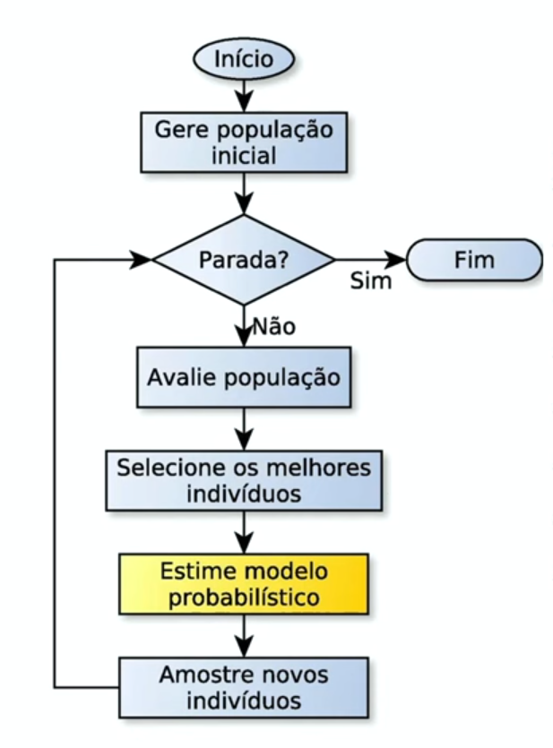

## What is a Genetic Algorithm?

Genetic algorithms are a class of algorithms that are bio inspired. They are based on the process of natural selection and are used to find the best solution to a problem from among a large number of possible solutions. They are used to find the optimal solution to a problem by using the principles of evolution, which is the process of natural selection.

## How does a Genetic Algorithm work?

A genetic algorithm works by creating a population of possible solutions to a problem. Each solution is represented by a string of bits, which is called a chromosome. The population is then evolved over a number of generations by applying the principles of natural selection, which are:

- Selection: The best solutions are selected from the population to form the next generation.
- Crossover: The selected solutions are combined to form new solutions.
- Mutation: The new solutions are mutated to introduce new genetic material.

This is a heuristic search algorithm that is used to find the best solution to a problem. It is based on the principles of natural selection and is used to find the optimal solution to a problem by using the principles of evolution. We want to find the best solution to a problem from among a large number of possible solutions.

## Optimization of Genetic Algorithms

### Process

1. We generate an initial population of solutions to the problem. (Random)
2. We evaluate each solution in the population to determine how good it is.
3. We select the best solutions from the population to form the next generation.  We can use the roulette wheel selection method to select the best solutions. This method selects the best solutions with a probability that is proportional to their fitness.
4. We combine the selected solutions to form new solutions.
5. We mutate the new solutions to introduce new genetic material. This prevents the population from converging to a local minimum. We can use the bit flip mutation method to mutate the new solutions. This method flips a random bit in the solution with a small probability.
6. We repeat steps 2-5 for a number of generations.

Usability example:

- In a game this reduce the repetitive behavior of a agent in the game, make new strategies and improve the performance of the agent.
- Teaching behavior from zero knowledge to a agent.
- Learning by try and error.
