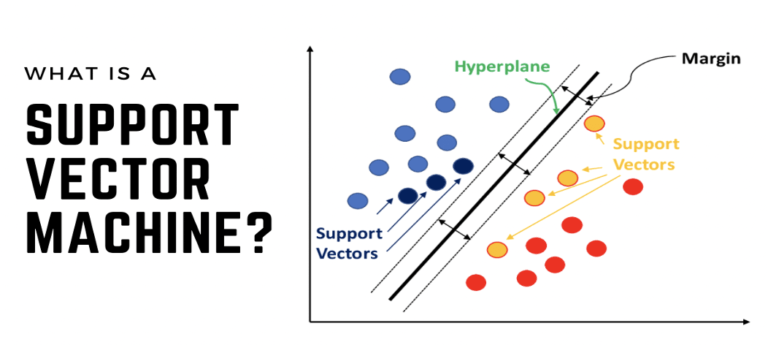

## What is SVM?

Its a algorithm used to classify data.  It's used to find the best hyperplane that separates the data into classes.
Its a supervised learning algorithm, so we need to have labeled data.

## The difference between SVM and Neural Networks

The SVM thrive to optimize the margin between the classes, while the neural networks thrive to optimize the accuracy (minimize the error).

## Result expected by a SVM

Aim to estimate P(x|y).

What is learn? The decision frontier.

## Why vector?

The "Support Vector" is the coordinate of the data that are the closest to the decision frontier. The decision frontier is the hyperplane that separates the data into classes.
The Support vectors are the nearest data points to the hyperplane. These are the critial elements of a data set, they are what help us to build the SVM.

## Outliers

The SVM is very sensitive to outliers. If we have a outlier, the decision frontier will change a lot. So, we need to remove the outliers before training the model.
